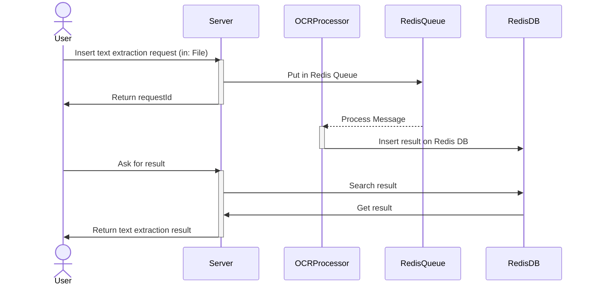

# Async OCR

Asynchronous REST OCR API.

## Architecture
- TypeScript + Express
- Tesseract.js
- Redis
- Bull

### Available endpoint

POST /api/ocr/recognition/file
> Insert request for text extraction

GET /api/ocr/recognition/result
> Get result of text extraction

### Example

> TODO:

## Script

- `start-dev` : run locally on development mode 
- `start-prod` : run locally on production mode
- `test` : run test
- `build` : build project
- `prod` : run in production and load env vars from deployment environment

## Docker
- `docker-build` : build docker image
- `docker-run-dev` : locally run api and redis (without password)

## Install and run Redis via Docker

1. Pull image: `docker pull redis`

2. Run with password: `"docker run --name redis -d -p 6379:6379 redis redis-server --requirepass 'redispassword'"`
3. Run without password: `"docker run --name redis -d -p 6379:6379 redis"`

### Redis utils command

> [Redis Cheatsheet](https://quickref.me/redis)

- **Connect to Redis:**   `redis-cli`
- **Login:**   `AUTH [password]`
- **Clean all data:**   `FLUSHDB` and `FLUSHALL`
- **Get value type:**   `TYPE [key]`
- **List all keys:**   `KEYS *`
- **Sorted set count:**   `ZCARD bull:recognize_eng:failed`
- **Show Sorted set element:**   `ZRANGE bull:recognize_eng:failed 0 0`
- **Read Hash:**   `HGETALL bull:recognize_eng:419`

## Bull

> [Bull Reference](https://github.com/OptimalBits/bull/blob/develop/REFERENCE.md)

## Test

- Run unit test with `npm run test`.
- Run specific test case with `npm run test -- ${testNamePattern}`. (Es: `npm run test -- Redis` will run only `Redis.test.ts`)

### Loadtest
`loadtest -n 20 -c 5 -P '{"url": "https://tesseract.projectnaptha.com/img/eng_bw.png","lang": "eng"}' http://localhost:8080/api/ocr/recognition -T application/json`